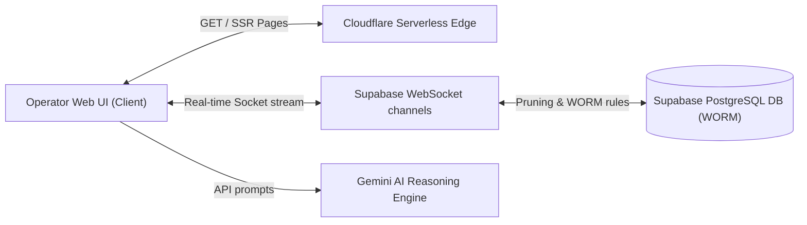

# 🛡️ VIGILANTIX AI — Enterprise SOC-SOAR Simulator Platform

[](https://www.typescriptlang.org/)
[](https://react.dev/)
[](https://tanstack.com/)
[](https://supabase.com/)
[](https://tailwindcss.com/)
[](https://workers.cloudflare.com/)

**VIGILANTIX AI** is a state-of-the-art, secure, and low-latency Security Operations Center (SOC) and Security Orchestration, Automation, and Response (SOAR) simulation control center. Designed with an aesthetic dark glassmorphism layout, it features real-time network topology tracking, automated threat injection loops, YAML playbook controls, and a context-aware virtual AI CISO assistant.

---

## ✨ Features & Capabilities

*   **⚡ Streaming Telemetry Graph**: Visualizes live attack metrics (DDoS packet loads, ransomware file operations, phishing click rates, data exfiltration bandwidth).
*   **🌐 SVG Network Topology**: Interactive node map with live network routing animations, scaling dynamically via SVG vectors.
*   **🛠️ Interactive SOAR Playbooks**: Declarative, syntax-validated YAML playbooks that map tasks dynamically across connected operators.
*   **🤖 AI Virtual CISO Assistant**: Sidebar assistant that tracks recent log entries to offer immediate contextual remediation advice.
*   **🔒 WORM Log Immutability**: Hardened Row Level Security (RLS) policies blocking log tampering, satisfying SOC 2 and ISO 27001 audit standards.
*   **🇪🇺 GDPR Client IP Masking**: Real-time IP address pseudonymization in public views protecting PII data.

---

## 🏗️ High-Level System Architecture

VIGILANTIX AI leverages an optimized SSR full-stack architecture backed by serverless edge workers and secure real-time PostgreSQL databases:



---

## 🚀 Quick Start Guide

### 1. Prerequisites
*   **Node.js**: v20 or greater (v22 LTS recommended)
*   **Package Manager**: `npm`

### 2. Setup Configuration
Clone the repository and install dependency nodes:
```bash
git clone https://github.com/rhaffle87/vigilantix-ai-sentinel.git
cd vigilantix-ai-sentinel
npm install
```

Create a `.env` file in the root directory:
```env
VITE_SUPABASE_URL=https://your-project-id.supabase.co
VITE_SUPABASE_ANON_KEY=your-anon-public-key
```

### 3. Run Locally
Start the local development server:
```bash
npm run dev
```
Open [http://localhost:5173](http://localhost:5173) in your web browser.

### 4. Build for Production
To typecheck and bundle client/server environments:
```bash
npm run build
```

---

## 📂 Deep-Dive Documentation Index

To help developers, security engineers, and DevOps operators onboard safely, we have compiled an exhaustive technical documentation wiki inside `/docs`:

*   **📖 [docs/overview.md](file:///e:/Projects/vigilantix-ai/docs/overview.md)**: Product mission, core tech stack matrix, and an exhaustive directory hierarchy map.
*   **🏗️ [docs/architecture.md](file:///e:/Projects/vigilantix-ai/docs/architecture.md)**: C4 systems topology maps, attack simulation sequence flows, and TanStack routing definitions.
*   **🔒 [docs/database_security.md](file:///e:/Projects/vigilantix-ai/docs/database_security.md)**: Schema relationships, covering index designs, SQL RLS WORM hardening policies, and GDPR IP masking rules.
*   **🌐 [docs/deployment_operations.md](file:///e:/Projects/vigilantix-ai/docs/deployment_operations.md)**: Config guides, Edge SSR security headers, Rollup chunking rules, and troubleshooting solutions.

---

## 🛡️ Security Posture & Standards

VIGILANTIX was built to qualify for production auditing standard controls:
*   **SOC 2 Type II Compliance**: Immutable logs ensured by denying `UPDATE` and `DELETE` access on log tables.
*   **ISO 27001 Access Integrity**: All writes and reads strictly bound to authenticated JSON Web Tokens (JWT) filtered through Row Level Security (RLS).
*   **Content Security Policy (CSP)**: Safe header execution parameters block XSS and clickjacking payloads globally.
