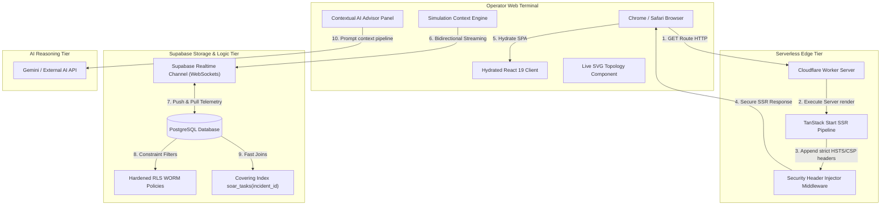

# VIGILANTIX System Architecture & Data Flows

This document details the software architecture, system boundaries, streaming pipelines, and execution lifecycles of the VIGILANTIX SOC platform.

---

## 🏗️ High-Level System Architecture

VIGILANTIX uses a secure **SSR (Server-Side Rendered) + Live-Sync Database** model. The application frontend is rendered by a serverless Cloudflare Workers execution container and hydrated as a single-page application on the browser client, communicating directly with a Supabase PostgreSQL backend through web socket streams and HTTPS endpoints.

### Mermaid Architecture Topology Map

---

## ⚡ Real-Time Threat Simulation Loop

The `SimulationContext` implements a custom client-side scheduler loop that mimics live cyberattacks, formats security telemetry, logs it locally, pushes it to Supabase via websocket triggers, and propagates state mutations back to visual subscriber elements like the SVG Network Topology map.

### Live Telemetry Request Sequence Flow

```mermaid
sequenceDiagram
    autonumber
    actor Operator as SOC Operator
    participant SimController as Simulation Controller
    participant SimContext as Simulation Context (State)
    participant Supabase as Supabase Database (REST/WS)
    participant Topology as Network Topology Map

    Operator->>SimController: Click "Trigger Attack Variant"
    SimController->>SimContext: triggerAttack(variantId)
    
    rect rgb(15, 23, 42)
        Note over SimContext: Generate Random Unique ID (INC-100000+)<br/>Assemble Log Payload & Incidents Row<br/>Compile Declared Playbook SOAR Tasks
    end

    SimContext->>Supabase: POST /rest/v1/incidents (Insert Incident Row)
    Supabase-->>SimContext: 201 Created (Success)

    par Parallel Async Inserts
        SimContext->>Supabase: POST /rest/v1/logs (Insert Attacker Network Log)
        SimContext->>Supabase: POST /rest/v1/soar_tasks (Insert Dependent Playbook Tasks)
    end
    Supabase-->>SimContext: 201 Created (All Pushed)

    %% Real-time updates
    Supabase-->>SimContext: Broadcast Realtime Mutations (Websocket Update)
    SimContext->>Topology: Mutate State & Increment Anomaly Load
    Topology-->>Operator: Re-render compromise node & animate data flows
```

---

## 🧩 Frontend Routing & State Architecture

### TanStack Router Filesystem Routes
VIGILANTIX uses TanStack Start's file-based routing model under `src/routes`:
*   `__root.tsx`: Holds global styles, navigation sidebar, query providers, and security metadata links.
*   `index.tsx`: Real-time SOC dashboard containing the interactive Network Topology graph and streaming charts.
*   `login.tsx`: Supabase OAuth / User Password portal.
*   `logs.tsx`: Read-only, full audit trail data tables.
*   `soar.tsx`: Interactive SOAR playbook list, execution timeline, and YAML configuration editor.
*   `billing.tsx`: Pricing tier selector and feature tables.

### Client State Contexts
1. **`AuthContext.tsx`**:
   * **Purpose**: Tracks active security operator sessions (`Session`, `User`) and wraps Supabase's `onAuthStateChange` hook to handle session expirations.
   * **Lifecycle**: Instantiated on application mount inside `RootShell`; forces non-authenticated requests to redirect to the `/login` route.
2. **`SimulationContext.tsx`**:
   * **Purpose**: Coordinates live simulation cycles, database inserts, and handles reactive state updates.
   * **Lifecycle**: Subscribes to Supabase real-time channels on mount, manages telemetry timers, and implements garbage collection upon components unmounting to prevent memory or socket leaks.
