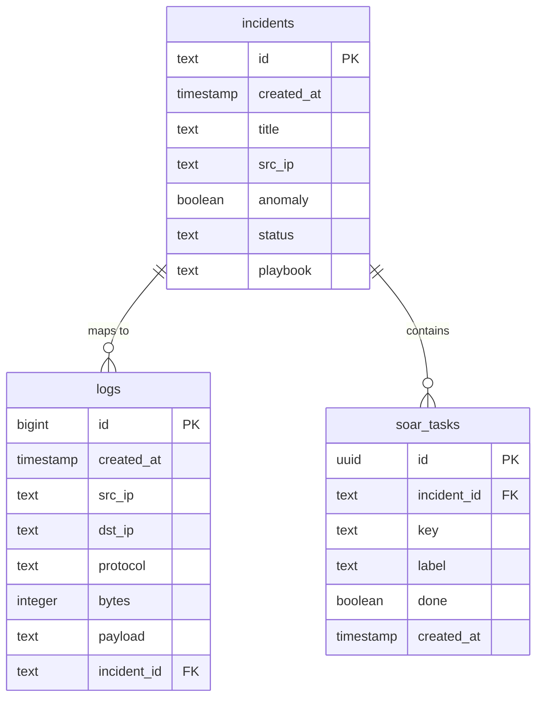
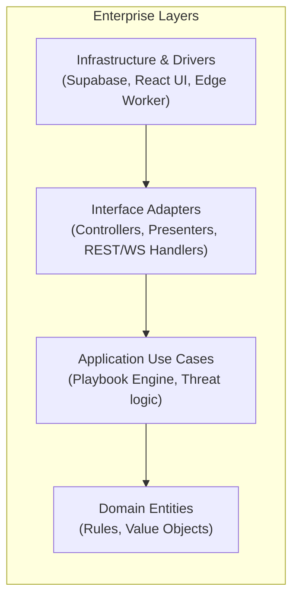

# Baseline SaaS Project Documentation — VIGILANTIX AI

Welcome to the baseline SaaS architecture and system lifecycle documentation for VIGILANTIX AI. This document serves as the foundational specification for developing, deploying, and maintaining our enterprise-grade multi-tenant Security Operations Center (SOC) and Security Orchestration, Automation, and Response (SOAR) simulation platform.

---

## 1. Project Overview

### 1.1 Platform Purpose
VIGILANTIX AI is designed as a high-fidelity, low-latency SOC and SOAR simulation environment that allows security operations teams to simulate, analyze, and automate response workflows against modern cyber threats. The platform bridges the gap between raw telemetry monitoring and automated response orchestration, providing teams with the tooling to run interactive incident drills without exposing production infrastructure to risk.

### 1.2 Target Users
The primary target users are Security Operations Center (SOC) analysts, incident responders, and security engineers who require a realistic environment to test and refine automation playbooks. Secondary users include Chief Information Security Officers (CISOs) and compliance auditors who use the platform to evaluate team readiness, verify response compliance, and review immutable audit logs.

### 1.3 Core Business Problems
Modern security teams suffer from severe alert fatigue, slow threat mitigation response times, and difficulty training analysts on complex multi-stage attack patterns. Furthermore, maintaining audit compliance (e.g., SOC 2 Type II, ISO 27001, GDPR) requires immutable proof of security event trails, which are difficult to model and verify in traditional sandboxes.

### 1.4 Major Features
The platform offers a real-time SVG-based interactive network topology map to visualize attack propagation, an automated threat generator injecting realistic logs, and a declarative YAML-based SOAR playbook orchestration engine. In addition, an AI-powered Virtual CISO assistant parses incident metadata to offer instant mitigation advice, while the backend implements Write Once, Read Many (WORM) database constraints to guarantee audit trail integrity.

### 1.5 Scalability Goals
VIGILANTIX AI is architected to scale horizontally as a multi-tenant SaaS application, supporting thousands of concurrent operators and high-throughput real-time log ingestion. The system aims for sub-second database write-to-client broadcast latency using modern serverless edge hosting and WebSocket synchronization.

---

## 2. Requirement Analysis

### 2.1 Functional Requirements
The platform must support user authentication with distinct tenant workspaces, automated network anomaly generation, and interactive node telemetry manipulation. The playbook engine must parse, validate, and execute declarative YAML playbooks, tracking execution progress in real-time. Ingestion pipelines must automatically calculate cryptographic log hashes and enforce write-only database constraints.

### 2.2 Non-Functional Requirements
Operational targets require 99.99% availability for API routing and edge delivery networks. Client hydration must occur in under 500 milliseconds, and real-time state broadcasts must complete within 100 milliseconds of database commit. The architecture must strictly prevent data deletion by operators, using database-level policies to enforce data retention compliance.

### 2.3 User Requirements
Operators require a single-pane threat dashboard that minimizes context switching by combining network visualization, log tables, and response triggers. Playbook creators need a human-readable YAML configuration interface with instant validation alerts. Compliance officers require a read-only audit panel that exports cryptographically signed logs.

### 2.4 Business Processes
The user lifecycle begins with secure tenant registration, moving through onboarding to workspace configuration. When a threat simulation is initiated, the engine executes logs, triggers notifications, maps alert nodes, and logs task updates. Subscriptions and usage quotas are verified at the gateway level before executing simulation steps.

### 2.5 Data Management
Relational telemetry data is divided into structured incidents, raw attacker logs, playbook tasks, and performance metric series. To prevent tampering, the database utilizes a WORM structure where logs and incident tables block UPDATE and DELETE queries. Data retention strategies enforce automatic archiving after 90 days to comply with data minimization regulations.

### 2.6 Integration Requirements
The platform integrates with external identity providers via OpenID Connect (OIDC) and SAML 2.0 for enterprise single sign-on. Threat intelligence routines query third-party APIs (such as VirusTotal) to enrich incident metadata. The AI assistant leverages the Google Gemini API to run context-aware risk evaluations on raw incident data.

### 2.7 Security Considerations
A Zero-Trust design is implemented across all network boundaries, enforcing transport layer security (TLS 1.3) and strict Row Level Security (RLS) on database tables. Operators are pseudonymized in audit logs to comply with privacy frameworks, and sensitive API keys are encrypted at rest using envelope encryption.

---

## 3. UX/UI Documentation

### 3.1 User Personas
Our primary persona is **Sarah, a Junior SOC Analyst**, who requires a visual interface that guides her through alert triage, prioritizing active compromises and clarifying response playbooks. Our secondary persona is **David, the Security Director & CISO**, who looks at high-level threat trends, team response times, and compliance-readiness indicators.

### 3.2 User Journeys
The typical journey begins at the login screen, landing on the real-time SOC dashboard showing the live network topology. When an anomaly is detected, the operator clicks the node, inspects the log details, and executes the recommended SOAR playbook. The operator then consults the Virtual CISO panel for immediate remediation before resolving the task, which writes a permanent entry to the audit log.

### 3.3 Wireframe Planning
The application layout is structured around a three-pane grid designed to prevent screen congestion. The left pane hosts the persistent sidebar navigation; the center pane features the interactive SVG topology map above the live scrolling log terminal; and the right-hand slide-out drawer displays the contextual AI assistant and active playbook checklist.

### 3.4 Responsive Design Principles
The interface uses a fluid grid system built with Tailwind CSS, collapsing the sidebar and right drawer on smaller viewports to prioritize the network map. Interactive nodes and canvas containers dynamically rescale to fit different tablet and desktop resolutions, maintaining visual balance without degrading readability.

### 3.5 Accessibility Standards
VIGILANTIX AI targets WCAG 2.2 AA compliance across all UI components. Key elements use semantic HTML wrappers, high-contrast text color combinations (exceeding a 4.5:1 ratio), and full keyboard navigation patterns, allowing analysts to tab through active compromise alerts and trigger playbooks without a mouse.

### 3.6 Usability Testing Workflows
Continuous usability evaluations are run by capturing anonymized interaction metrics, tracking task-completion rates, and logging navigation pathing. Usability bugs are surfaced in staging environments before release, ensuring that operators can respond to simulation events without interface confusion.

### 3.7 Design System Consistency
The UI uses custom design tokens for color schemes (sleek dark mode using slate and zinc, with red/orange accents for anomalies), typography (Outfit for headers, Inter for body copy), and micro-animations. Animations are hardware-accelerated to provide immediate feedback on hover, drag, and selection actions.

---

## 4. System Architecture

### 4.1 Frontend Architecture
The frontend is built using React 19 as a component-driven Single Page Application (SPA), utilizing TanStack Start to handle Server-Side Rendering (SSR) and client hydration. The UI layers are divided into reusable design tokens, layout wrappers, context providers, and route-level components to separate rendering concerns from application logic.

### 4.2 Backend Services
The backend is structured around a serverless architecture executing on Cloudflare Workers edge nodes. The serverless tier acts as an API gateway, handling request validation, security header injection, and data proxying, while database-as-a-service (DBaaS) integration provides scalable data storage.

### 4.3 API Communication
Real-time state synchronization is managed via WebSockets through Supabase Realtime Channels, allowing the server to broadcast incident updates to connected clients. Standard data fetching and configuration updates are performed using secure HTTPS REST endpoints with JSON payloads.

### 4.4 Database Structure
The relational database utilizes PostgreSQL to organize data into incidents, logs, soar_tasks, and metric_series. The schema enforces strict foreign key constraints and covers query patterns with indexes optimized for fast joins, ensuring low-latency retrieval under heavy simulation loads.



### 4.5 Clean Architecture Implementation
The codebase separates business rules from infrastructure mechanisms by organizing files into Domain, Application, Interface, and Infrastructure layers. The Domain layer contains pure business entities (e.g., threat rules); the Application layer coordinates use cases; the Interface layer adapts controllers and presentation elements; and the Infrastructure layer hosts the database and framework integrations.



### 4.6 Domain-Driven Design (DDD)
The platform is organized into distinct Bounded Contexts, isolating Threat Simulation, Playbook Orchestration, Operator Identity, and Compliance Logging. Each context maintains its own aggregate roots and entities, ensuring domain logic is decoupled and can be migrated independently as services scale.

### 4.7 N-tier Architecture
The system implements a classic three-tier deployment architecture. The Presentation Layer (browser client) manages layout rendering; the Application Logic Layer (Cloudflare Workers) processes domain routing and session checks; and the Data Tier (Supabase Postgres) manages relational constraints and storage.

### 4.8 Monolithic vs Microservices Comparison
VIGILANTIX AI is designed as a modular monolith deployed serverless to edge nodes. This approach minimizes network latency and operational overhead compared to a distributed microservice network, while maintaining clean domain boundaries that allow individual contexts to be refactored into standalone services if load scales.

### 4.9 Containerized Infrastructure
For development, self-hosted enterprise deployments, and integration testing, services are containerized using Docker. This ensures environment consistency across development, staging, and production environments, shielding the software from underlying OS and dependency mismatches.

---

## 5. Technology Stack

### 5.1 Recommended Frontend Frameworks
*   **React 19**: Modern component-based view rendering with stable Concurrent Features.
*   **TypeScript**: Strict typing across components, models, and hooks to reduce runtime errors.
*   **TanStack Start**: Type-safe routing, server functions, and out-of-the-box hydration.

### 5.2 Backend Technologies
*   **TypeScript**: Unified language strategy across edge server files.
*   **Cloudflare Workers**: High-performance, serverless edge execution environments.
*   **Vite Node SSR**: Integrated compilation environment for quick local iterations.

### 5.3 Databases
*   **Supabase PostgreSQL**: Relational engine supporting advanced indexing and built-in replication.
*   **TimescaleDB (or partitioned tables)**: High-speed storage for streaming metric series and system logging.

### 5.4 Authentication Systems
*   **Supabase GoTrue (JWT-based)**: Secure user accounts with OAuth (GitHub, Google) and SAML SSO support.
*   **RBAC Token Validation**: Stateless JWT claims validated at the Edge Worker boundary.

### 5.5 API Standards
*   **REST (JSON-over-HTTPS)**: Standard payload format for client-server transactions.
*   **WebSocket Protocols**: Low-latency, bidirectional channel streams for real-time threat maps.

### 5.6 CMS Options
*   **Strapi (Headless CMS)**: Simple interface for administrators to modify playbook templates, help documentation, and threat metadata without code changes.

### 5.7 DevOps Tooling
*   **GitHub Actions**: CI/CD pipeline automation for testing and deployment.
*   **Terraform / OpenTofu**: Infrastructure as Code (IaC) configuration for database tables and edge routing.

### 5.8 Monitoring Systems
*   **Sentry**: Client-side error tracking and performance profiling.
*   **Grafana Loki / Prometheus**: Log aggregation and system resource monitors.

### 5.9 Cloud Infrastructure Platforms
*   **Cloudflare Edge Network**: Fast asset delivery, edge routing, and serverless hosting.
*   **Supabase DB Cloud**: Scalable, managed relational database infrastructure.

---

## 6. Integration Documentation

### 6.1 Single Sign-On (SSO)
Enterprise SSO is handled through OIDC and SAML integrations managed by GoTrue. When a corporate client authenticates, the identity provider returns a validated profile that is mapped to a tenant organization, assigning the correct operator permissions.

### 6.2 REST APIs
Our REST API provides external systems with HTTPS endpoints to programmatically trigger attack variants, retrieve active incident reports, or ingest custom log payloads. Endpoints enforce strict API key authentication, rate limits, and JSON payload validation.

### 6.3 External Services
The simulation service communicates with external intelligence providers (e.g., VirusTotal) to fetch metadata for threat evaluation. Calls are managed asynchronously using edge fetch pools, caching results to prevent hitting third-party API rate ceilings.

### 6.4 Webhooks
When an anomaly status shifts to "critical", the webhooks dispatcher posts a signed JSON payload to configured external URLs. This alerts third-party integrations (like Slack, Microsoft Teams, or Jira) to notify security teams.

### 6.5 Third-Party Integrations
Built-in integrations allow operators to synchronize resolved SOAR tasks directly to task management systems. The integration engine maps platform schemas to external API fields, handling connection retries and token refreshing automatically.

### 6.6 API Gateways
The Cloudflare Worker acts as the API Gateway, handling SSL termination, rate-limiting, CORS configuration, and security header injection. Invalid requests are blocked at the edge before hitting downstream database services.

### 6.7 Inter-Service Communication
Internal communication between simulation engines, the AI module, and compliance logging is managed using event streams. This asynchronous pattern isolates long-running operations (like AI prompt evaluations) from critical rendering tasks.

---

## 7. Security Documentation

### 7.1 HTTPS/SSL Implementation
All traffic is routed over HTTPS, enforcing TLS 1.3 with a fallback to TLS 1.2. The edge server injects strict Security Headers (HSTS, Content Security Policy, X-Frame-Options, X-Content-Type-Options) to protect clients from modern web exploits.

### 7.2 Authentication and Authorization Mechanisms
Authentication uses JWT tokens containing tenant claims. Tokens are stored securely in the client state and passed in the Authorization header. On the server side, database Row Level Security (RLS) validates the JWT against the user's role before processing queries.

### 7.3 Role-Based Access Control (RBAC)
User permissions are divided into Guest, Operator, and Admin roles. Guests can view dashboards; Operators can trigger simulations and modify playbook tasks; and Admins can manage configurations and tenant billing. These roles are verified at both the API and database levels.

### 7.4 XSS Prevention
The React 19 rendering pipeline automatically escapes dynamic values to protect against Cross-Site Scripting (XSS). User inputs are sanitized on the server before storage, and CSP rules block the execution of unauthorized inline scripts.

### 7.5 CSRF Protection
Cross-Site Request Forgery (CSRF) is blocked by configuring authorization headers rather than relying solely on ambient browser credentials. Edge CORS rules restrict endpoint access to verified domain origins.

### 7.6 SQL Injection Mitigation
Database interaction relies on parameterized queries via the Supabase client. Direct SQL strings are avoided in application logic, ensuring that Postgres treats user input as data parameters rather than executable SQL code.

### 7.7 Logging and Monitoring
Administrative changes, authentication failures, and API requests are written to an immutable system log. These logs are pushed to an offsite aggregator for analysis, enabling security audits to track changes back to specific operator actions.

### 7.8 Backup Systems and Disaster Recovery Planning
The database is backed up daily with Point-in-Time Recovery (PITR) enabled, allowing restoration to a specific second in the event of corruption. Backups are encrypted and replicated across regions, ensuring high availability and compliance with disaster recovery targets.

---

## 8. Infrastructure & Deployment

### 8.1 Cloud Hosting
The application frontend and server rendering are hosted on Cloudflare's Edge Network, distributing the workload across global edge locations. The relational database is hosted on Supabase's managed Postgres platform, located in a region close to the primary user base to minimize latency.

### 8.2 Containerized Deployment
Docker is utilized to package services for staging environments and on-premise deployments. The docker-compose configuration sets up Postgres, the API layer, and the static client, providing developers with a local replica of the production stack.

### 8.3 Kubernetes Orchestration
For large enterprise deployments, VIGILANTIX AI uses Kubernetes to manage container orchestration. Helm charts define the layout for the edge proxy, scaling pods horizontally based on CPU load and network traffic.

### 8.4 CI/CD Pipelines
Our CI/CD pipeline runs on GitHub Actions, executing automated tests, checking formatting, and running vulnerability scans on every code push. Upon passing, a GitOps pipeline automatically builds and deploys the update to Cloudflare and Supabase.

### 8.5 CDN Usage
Static assets, scripts, and fonts are distributed via Cloudflare's CDN. Cache policies are configured to optimize resource delivery while ensuring that real-time components bypass the cache to fetch fresh data.

### 8.6 Domain Configuration
DNS records are managed via Cloudflare, enforcing DNSSEC to prevent spoofing. Subdomain isolation routes each tenant to their own workspace (e.g., `tenant1.vigilantix.ai`), ensuring logical separation at the network level.

### 8.7 Monitoring Systems
Centralized dashboards monitor CPU, memory, API latency, and database connection pools. Automatic alerts trigger notifications on Slack when metrics exceed predefined thresholds, allowing operations teams to respond to issues.

### 8.8 Scalability Strategies
The platform scales horizontally by deploying additional stateless edge containers. Database load is managed through connection pooling, read replicas, and caching frequently queried configurations in Redis.

### 8.9 Infrastructure Management Workflows
Infrastructure changes are managed using Terraform, tracking configuration updates in version control. This ensures that network rules, database tables, and environment variables are deployed consistently across development, staging, and production.

### 8.10 VM-Based vs Containerized Deployment
Deploying to virtual machines (VMs) provides strict OS-level isolation and direct access to hardware, but comes with higher resource overhead, slower startup times, and complex scaling. In contrast, containerized deployment offers faster startups, efficient resource usage, and simpler orchestration, making it the preferred approach for our edge-first, cloud-native SaaS model.

---

## 9. Testing Strategy

### 9.1 Unit Testing
Unit tests target pure logic, utility functions, and UI components using Vitest and React Testing Library. These tests verify that individual units function correctly under mock inputs without network dependencies.

### 9.2 Integration Testing
Integration tests evaluate interactions between the edge application, API endpoints, and the database. The suite verifies that database migrations run without errors and that WebSocket events broadcast state updates correctly.

### 9.3 Frontend Testing
Playwright runs end-to-end tests across chromium, webkit, and firefox. The tests simulate user actions (such as logging in, selecting a network node, and triggering playbooks) to verify that the UI updates correctly.

### 9.4 API Testing
API tests verify that REST endpoints return the correct JSON formats and HTTP status codes. The suite checks that invalid playbooks are rejected with 400 Bad Request, while unauthorized calls return 401 Unauthorized.

### 9.5 Performance Testing
We run performance and load testing using k6, simulating thousands of concurrent operators to measure API response times and database throughput. This helps identify bottleneck queries before they impact production.

### 9.6 Infrastructure Testing
Terraform configuration files undergo automated scans (using tools like Trivy) to detect security misconfigurations, open ports, or overly permissive access rules before changes are applied.

### 9.7 Security Testing
Our CI/CD pipeline runs automated vulnerability scans (using Snyk) to check npm packages for known security issues. Dynamic analysis tools are run periodically to check for common vulnerabilities like OWASP Top 10 exploits.

---

## 10. Maintenance & Operations

### 10.1 CMS Workflows
Content updates to playbook templates, tutorials, and alert definitions are managed through the headless CMS. When an update is published, the CMS triggers a webhook that clears the edge cache, ensuring clients receive the updated templates.

### 10.2 Admin Management
Administrators use a secure console protected by multi-factor authentication (MFA) to manage tenants, view resource usage, and update billing details. All administrative actions are recorded in an audit log.

### 10.3 Monitoring Procedures
Operations teams perform weekly reviews of system metrics, error rates, and database performance. Metric thresholds are adjusted regularly to reduce false alerts while ensuring critical anomalies are caught.

### 10.4 Operational Checklists
Detailed playbooks guide teams through database migrations, SSL certificate renewals, and onboarding new tenants. These checklists ensure that operational changes are carried out consistently, minimizing human error.

### 10.5 Logging Systems
Logs are collected from the frontend, edge API, and Postgres database, then indexed in Grafana Loki. Operators query this system to trace errors across the stack, correlating client requests with database logs.

### 10.6 Update Management
Updates are deployed using blue-green deployment strategies to ensure zero downtime. If an update fails, the system rolls back to the previous stable state, and database migrations are designed with backward compatibility in mind.

### 10.7 Incident Response Workflows
System alerts are categorized by severity. Critical alerts notify the on-call engineer via automated paging tools, while lower-priority issues are logged in the task queue for review during business hours.

---

## 11. Developer Documentation

### 11.1 Coding Standards
Developers follow strict formatting rules enforced by ESLint and Prettier. The project uses TypeScript in strict mode, requiring explicit types and preventing compilation if typescript errors are present.

### 11.2 Folder Structures
The codebase is structured around clean architecture principles to keep files organized:

```text
vigilantix-ai/
├── docs/                 # System documentation files
├── public/               # Public assets and icons
├── src/                  # Source code directory
│   ├── components/       # UI elements and design system components
│   │   ├── ui/           # Radix UI wrapper elements
│   ├── context/          # State management context providers
│   ├── hooks/            # Reusable React hooks
│   ├── lib/              # Supabase and API client files
│   ├── routes/           # File-system based router pages
│   ├── styles.css        # Global CSS and custom animations
```

### 11.3 API Documentation Standards
All REST API endpoints are documented using OpenAPI 3.0 specs. Responses use standard HTTP status codes:
*   `200 OK` for successful requests
*   `201 Created` for successful database writes
*   `400 Bad Request` for invalid input formatting
*   `401 Unauthorized` for invalid or missing tokens
*   `403 Forbidden` for insufficient role permissions
*   `500 Internal Server Error` for system-level issues

#### API Endpoint Example
`POST /api/v1/simulations/trigger`
*   **Request Headers**: `Authorization: Bearer <JWT>`
*   **Request Body**:
    ```json
    {
      "variant_id": "ransomware_simulation",
      "target_node": "node-04"
    }
    ```
*   **Response Body (`201 Created`)**:
    ```json
    {
      "success": true,
      "incident_id": "INC-883011",
      "created_at": "2026-05-26T08:15:00Z"
    }
    ```

### 11.4 Environment Setup
To run the platform locally, developers copy `.env.example` to `.env`, populating the Supabase URL, anon key, and service role key. Local dependencies are installed with `npm install`, and the dev server is launched using `npm run dev`.

### 11.5 Branching Strategies
The repository uses GitHub Flow, where feature development is isolated to `feature/<name>` branches. Pull requests targeting the main branch require passing CI/CD tests and an approved code review before merging.

### 11.6 Deployment Guides
Deploying updates requires pushing passing code to the main branch. The CI/CD pipeline automatically compiles frontend assets, deploys the edge script to Cloudflare, and applies SQL migrations to Supabase.

### 11.7 Contribution Guidelines
When submitting changes, developers must include unit tests for new logic, write semantic commit messages (e.g., `feat: add api key auth`), and update related documentation files.

---

## 12. Future Scalability

### 12.1 Migration Toward Microservices
As ingestion load scales, logical domains (such as log analytics and simulation scheduling) will be extracted into independent microservices. This allows services to scale dynamically, preventing high log volumes from impacting the dashboard UI.

### 12.2 Distributed Systems
To support global enterprise clients, the ingestion pipeline will integrate with distributed message queues (e.g., Kafka). This provides a reliable buffer for incoming logs, ensuring data is not lost during high-volume spikes.

### 12.3 Database Scaling
Future database scaling will involve database sharding and read/write segregation. Read replicas will handle dashboard queries, while write operations are directed to the primary database nodes, optimizing performance.

### 12.4 Multi-Tenant SaaS Architecture
The multi-tenant architecture will offer customizable tenant levels. While standard tiers share database tables with column-level filtering, enterprise clients can request a separate database container for higher compliance isolation.

### 12.5 Observability Systems
Future updates will introduce OpenTelemetry to trace requests across edge APIs and database queries. This provides developers with detailed execution maps to diagnose latency issues in production.

### 12.6 AI Integration Opportunities
We plan to integrate advanced AI agents that can automatically generate playbooks based on historical log patterns. In addition, natural language query interfaces will allow operators to search audit logs using simple search requests.

### 12.7 Enterprise-Level Infrastructure Evolution
The infrastructure will evolve to support multi-cloud deployments, preventing vendor lock-in. This enables enterprise deployments to run within private VPC networks, satisfying security requirements such as FedRAMP.
