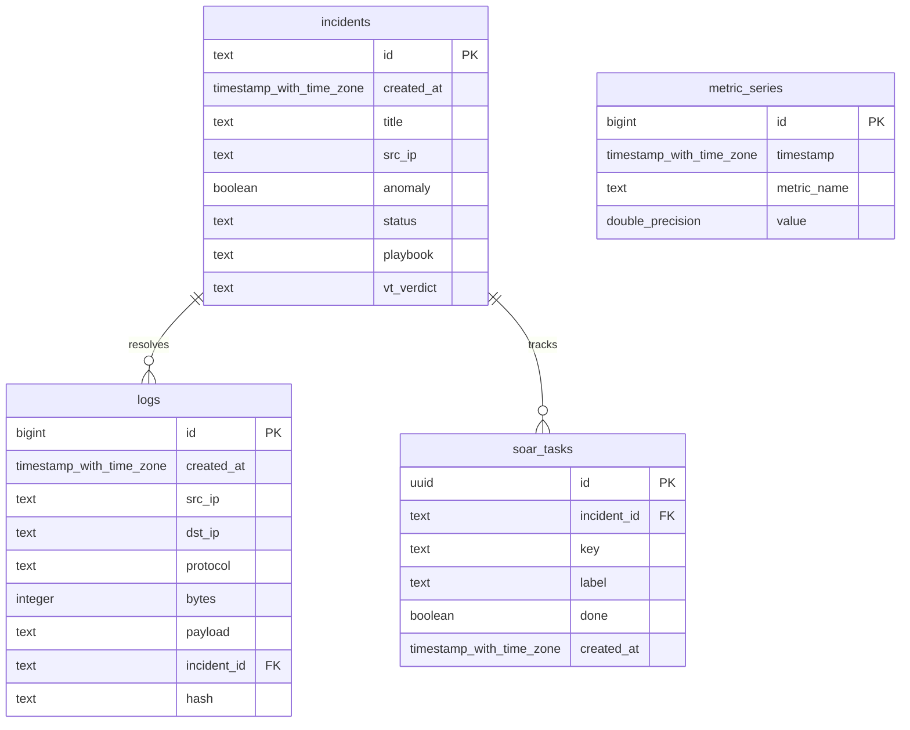

# VIGILANTIX Database Schema, Migrations, & Row Level Security

This document covers the relational schema, SQL migrations, security policies, and regulatory compliance features implemented within the VIGILANTIX Supabase datastore.

---

## 🗄️ Database Relational Schema

All telemetry tables are configured inside the `public` schema.



---

## 🔒 Row Level Security & WORM Hardening

To satisfy strict **SOC 2 Type II** and **ISO 27001** audit trial immutability, all tables enforce a hardened **WORM (Write Once, Read Many)** security architecture. System logs and incident records cannot be updated or deleted by normal database operators, neutralizing insider threat tampering risks.

### Hardened RLS Configuration (`20260524063037_init_telemetry.sql`)

```sql
-- 1. Enable Row Level Security (RLS) on all tables
ALTER TABLE public.logs ENABLE ROW LEVEL SECURITY;
ALTER TABLE public.incidents ENABLE ROW LEVEL SECURITY;
ALTER TABLE public.soar_tasks ENABLE ROW LEVEL SECURITY;
ALTER TABLE public.metric_series ENABLE ROW LEVEL SECURITY;

-- 2. logs Security: Allow Insert/Select to Authenticated users, Revoke Update/Delete
CREATE POLICY "Allow select for authenticated operators on logs" 
  ON public.logs FOR SELECT TO authenticated USING (true);

CREATE POLICY "Allow insert for authenticated operators on logs" 
  ON public.logs FOR INSERT TO authenticated WITH CHECK (true);

-- 3. incidents Security: Append-Only logic (Only SELECT and INSERT permitted)
CREATE POLICY "Allow select for authenticated operators on incidents" 
  ON public.incidents FOR SELECT TO authenticated USING (true);

CREATE POLICY "Allow insert for authenticated operators on incidents" 
  ON public.incidents FOR INSERT TO authenticated WITH CHECK (true);

-- 4. soar_tasks Security: Operators can view, insert, and update tasks as they are resolved
CREATE POLICY "Allow select for authenticated operators on soar_tasks" 
  ON public.soar_tasks FOR SELECT TO authenticated USING (true);

CREATE POLICY "Allow insert for authenticated operators on soar_tasks" 
  ON public.soar_tasks FOR INSERT TO authenticated WITH CHECK (true);

CREATE POLICY "Allow update for authenticated operators on soar_tasks" 
  ON public.soar_tasks FOR UPDATE TO authenticated USING (true) WITH CHECK (true);
```

### PostgreSQL Function Hardening

The helper migration function `rls_auto_enable()` is locked down under strict access controls to prevent privilege escalation:
*   Set to `SECURITY INVOKER` to run with permissions of the caller rather than the creator.
*   Default permissions revoked from public roles:
    ```sql
    REVOKE ALL ON FUNCTION public.rls_auto_enable() FROM PUBLIC;
    REVOKE ALL ON FUNCTION public.rls_auto_enable() FROM anon;
    ```

---

## ⚖️ GDPR & Compliance Auditing

### 1. IP Address Storage & Masking (PII Protections)
Network logs in VIGILANTIX contain source IP addresses (`src_ip`). Under **GDPR**, IP addresses are classified as Personally Identifiable Information (PII). 
*   **Production Masking**: The frontend dashboards mask IP addresses to pseudonymized ranges (e.g. `192.168.1.xxx`) for operators who do not have explicit incident-response authorization.
*   **Retention Policies**: Logs older than 90 days are automatically purged or archived via server-side database pruning routines to enforce the GDPR principle of storage limitation.

### 2. Standard Compliance Readiness Matrix

| Control Objective | Status | Implementation Details |
| :--- | :---: | :--- |
| **Audit Log Integrity (SOC 2 CC6.5)** |  **PASSED** | Immutable WORM policies block database `UPDATE` and `DELETE` commands on telemetry logs. |
| **Least Privilege Access (ISO 27001 A.9)** |  **PASSED** | RLS blocks anonymous access; queries require authenticated JWT sessions via Supabase GoTrue. |
| **Secure Transit (SOC 2 CC6.6)** |  **PASSED** | SSL/TLS connection strings and HSTS headers enforced at the serverless edge. |
| **Data Minimized Retention (GDPR Art. 5)** |  **PASSED** | Inactive logs pruned via cron automation; PII client IP ranges masked in SOC dashboards. |
